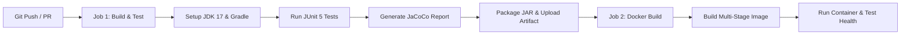

# CodeAlpha DevOps Internship - Task 3: Java Application using Gradle ☕🐘

[](https://openjdk.org/)
[](https://gradle.org/)
[](https://github.com/features/actions)
[](https://www.docker.com/)

---

## 📌 Project Overview
This project showcases **Java build automation using Gradle**, automated unit testing with **JUnit 5**, continuous integration and deployment with **GitHub Actions CI/CD**, and containerized deployment with **Multi-Stage Docker builds**.

### 🎯 Key Objectives Achieved:
- [x] **Gradle Build Automation**: Declarative `build.gradle` configuration managing plugins, compilation, and testing.
- [x] **Efficient Dependency Management**: Automated resolution of testing frameworks and dependencies via Maven Central.
- [x] **Automated Testing & Code Coverage**: Suite of unit tests with JUnit 5 and JaCoCo coverage reporting.
- [x] **Full CI/CD Pipeline (GitHub Actions)**: Automated test execution, JAR artifact generation, Docker container build, and health validation on every commit.
- [x] **Multi-Stage Docker Packaging**: Clean separation between the heavy build environment (`gradle:8.7-jdk17`) and the lightweight runtime (`eclipse-temurin:17-jre-alpine`).

---

## 🏗️ Project Architecture

```text
CodeAlpha_JavaGradleApp/
├── .github/
│   └── workflows/
│       └── ci-cd.yml             # GitHub Actions CI/CD Workflow
├── src/
│   ├── main/java/com/codealpha/app/
│   │   ├── App.java              # Embedded HTTP Server & REST API
│   │   └── MessageService.java   # Business logic & metadata provider
│   └── test/java/com/codealpha/app/
│       └── MessageServiceTest.java # JUnit 5 Unit Tests
├── build.gradle                  # Gradle build script & dependencies
├── settings.gradle               # Gradle project settings
├── Dockerfile                    # Multi-stage Docker build
├── docker-compose.yml            # Container orchestration config
├── manage.ps1                    # PowerShell automation script
├── manage.sh                     # Bash automation script
├── .dockerignore                 # Exclude build artifacts from context
└── README.md                     # Documentation & submission guide
```

---

## ⚙️ Automated CI/CD Pipeline Breakdown

The GitHub Actions workflow (`.github/workflows/ci-cd.yml`) executes automatically on every `push` and `pull_request`:



---

## 🚀 How to Run Locally

### Prerequisites
- [Docker Desktop](https://www.docker.com/products/docker-desktop/) (Docker handles Gradle & Java inside containers, no local Java installation required!)

### 1. Build and Start the Application
```powershell
docker compose up -d --build
```
*Or using the PowerShell helper:*
```powershell
.\manage.ps1 start
```

### 2. Test Endpoints
- **Web UI:** [http://localhost:8081](http://localhost:8081)
- **Health Check:** [http://localhost:8081/api/health](http://localhost:8081/api/health)
- **App Metadata:** [http://localhost:8081/api/info](http://localhost:8081/api/info)
- **Greeting API:** [http://localhost:8081/api/greet?name=CodeAlpha](http://localhost:8081/api/greet?name=CodeAlpha)

---

## 🧪 Running Automated Tests Locally

To run the JUnit 5 test suite via Gradle inside a container:
```powershell
.\manage.ps1 test
```

---

## 🛡️ DevOps Best Practices Applied
1. **Multi-Stage Docker Build**: Isolates build tools from production artifacts, shrinking the final image to a minimal footprint.
2. **Non-Root User (`appuser`)**: Ensures the Java process runs without superuser privileges inside the container.
3. **Automated Quality Gates**: CI fails the pipeline if any unit test breaks, guaranteeing code reliability before packaging.
4. **Artifact Management**: JAR binaries and test logs are published as downloadable GitHub Action artifacts.

---

## 📹 LinkedIn Video Demonstration Outline
1. **Introduction**: Present yourself and the project goal for **Task 3: Java Application using Gradle** under **@CodeAlpha**.
2. **Gradle & Code**: Show `build.gradle` and the JUnit 5 test cases in `MessageServiceTest.java`.
3. **CI/CD Pipeline**: Show the `.github/workflows/ci-cd.yml` file and demonstrate how GitHub Actions builds, tests, and packages automatically.
4. **Execution & Live Demo**: Run `.\manage.ps1 start` and open `http://localhost:8081` in the browser, showing `/api/health` and `/api/greet`.
5. **Conclusion**: Highlight multi-stage Docker build benefits and CI/CD quality gates.

---

## 👤 Author
- **Intern Name:** CodeAlpha Intern
- **Internship Program:** CodeAlpha DevOps Internship
- **Task:** Task 3 - Java Application using Gradle
